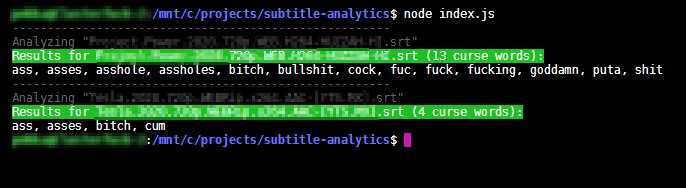

# Find out the amount of profanity via subtitle files (.srt)

## Installing
* Clone the repository
* `npm i`

## Using
* Add your `.srt` files to the `subtitles` directory.
* `node index.js`

### Notes
* I've censored and added the `.srt` files to `.gitignore` because apparently there can be some copyright related issues or something.
